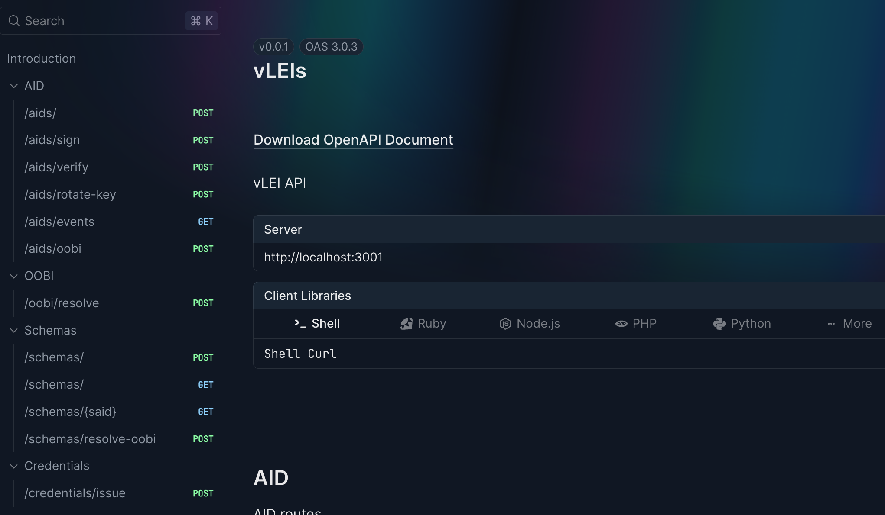
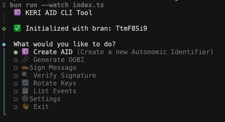
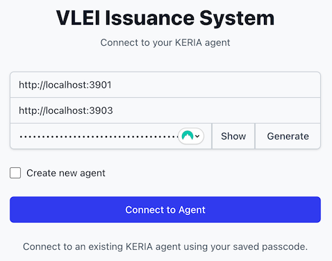
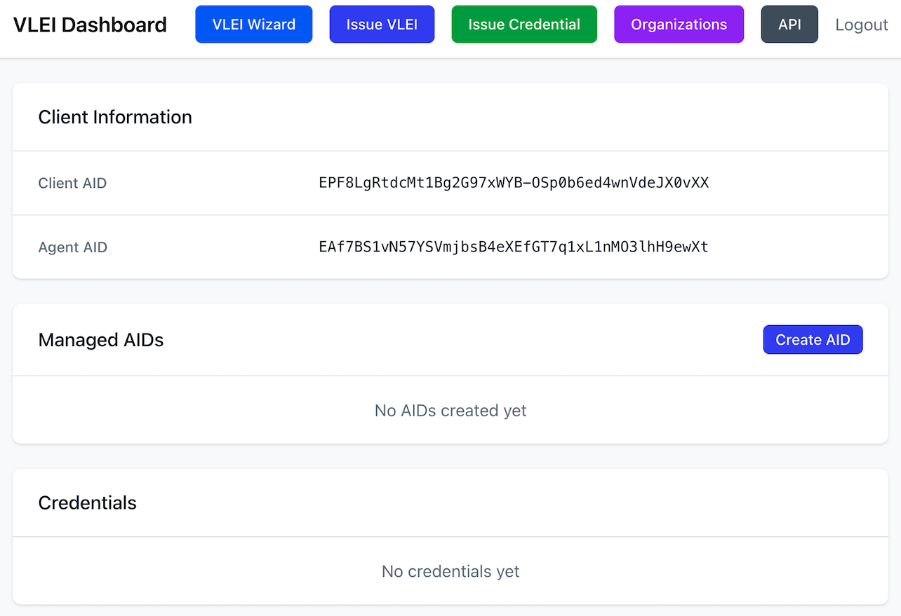
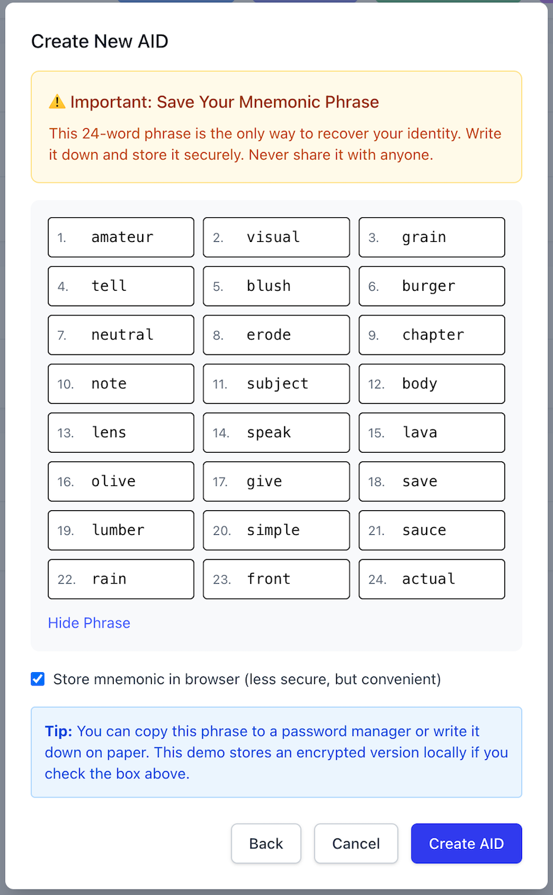
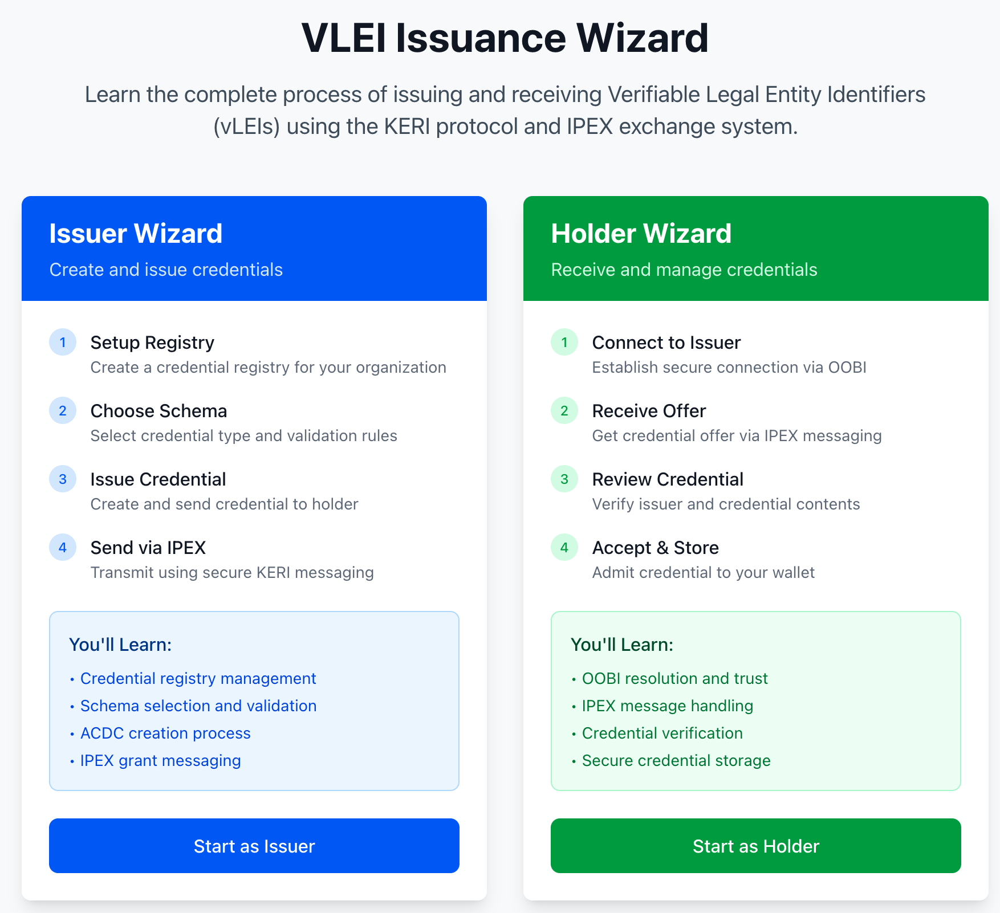

[back](../README.md)
# API and interfaces

In addition to the vlei-training, this fork adds:

 * An API which drives end-user flows
 * A command-line user interface
 * A web UI

# API

This API is used to:

 * Onboard new entities (QVIs, Individuals, Companies, Organisations)
 * Attest credentials (i.e. issue vLEIs) to those entities

# Command Line Interface

Using either a command-line interface:

# Web Interface

## Initialise or Connect an instance:

## Browse entities and credentials:

## Create new entities:

## Use an onboarding wizard 
