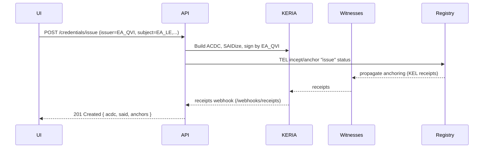
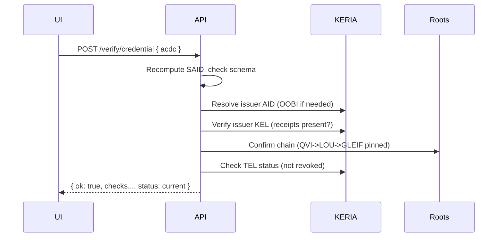

# Backend-for-frontend API for VLEIs

# Actors & artefacts (quick primer)

 * QVI (issuer) AID
The issuing identity (in this MVP, we “act as” a QVI). 
It’s a transferable KERI AID with a KEL (inception, rotations, receipts). 


* Legal Entity (LE) AID: the organization’s own transferable AID.

* Person AID: each individual’s transferable AID.

* Credentials (ACDCs):

  * Legal Entity vLEI Credential (issued by a QVI to the org). Reporting of issuances/revocations to GLEIF is required. 

  * Role Credentials:

    * OOR (Official Org Role) — issued by a QVI to a person in an official role. Reported to GLEIF. 

    * ECR (Engagement Context Role) — issued either by the Legal Entity itself (if it holds a Legal Entity vLEI) or by a QVI as a value-added service. Best fit for routine hires/fires/role changes. 

 * OOBIs: URLs that let others discover and fetch verifiable material (AID KELs, schema SAIDs, etc.). They bootstrap discovery; trust comes from KERI verification. 

 * Schemas (ACDC): self-addressing, immutable (SAID-anchored). Verifiers fetch by SAID (often via an OOBI). 

See [trustoverip.github.io](trustoverip.github.io)

## Resource Model:

 - AID                 (your controller identifiers)
 - OOBI                (discovery + exchange)
 - Schema              (ACDC schemas, vLEI-specific)
 - Credential          (ACDC objects incl. vLEIs)
 - Presentation        (A CDC presentation + proof)
 - Verification        (results of verifying presentations/credentials)
 - EventStream         (KEL/TEL events)
 - TrustRoots          (GLEIF/LOU/QVI anchors you accept)


# REST Endpoints (MVP)

## AIDs

### ✅ POST /aids

 * Create a new transferable AID via KERIA (through signify-ts).

 * Body: { "alias": "issuer-qvi", "wits": ["..."], "transferable": true, "icount": 1, "ncount": 1 }

 * Returns: { "aid": "EA...", "oobi": "http(s)://.../oobi/EA...", "kel": {...} }

### ⏳ GET /aids → list

### ⏳ GET /aids/{aid} → 
details (alias, current keys/threshold, last sn, witnesses)

### ⏳ POST /aids/{aid}/rotate

Body: { "toad": 3, "adds": [], "cuts": [] }

Returns: rotation event + pending receipts

## OOBI

### ✅ POST /oobis/resolve

 * Body: { "oobi": "http(s)://issuer.example/oobi/EA..." }

 *  Resolves & caches the controller’s AID (imports to your KERIA/agent).

 * Returns: controller AID, verified endpoints.

### ⏳ GET /oobis/{aid} → where you learned this AID from

## Schemas

### ⏳ GET /schemas → list of known schema SAIDs (vLEI root + roles)

### ⏳ POST /schemas

 * Body: { "label": "vLEI-LE-credential", "schema": { ...ACDC schema JSON... } }

 * Stores schema + computes SAID; returns { "said": "EE..." }

(For MVP you can seed with the canonical vLEI schemas and make this read-only.)

## Credentials (ACDC issuance & storage)

### ⏳ POST /credentials/issue

 * Issues a vLEI (an ACDC) from issuer AID to subject AID with a schema.

Body:
```json
{
  "issuer": "EA_ISSUER_QVI",
  "subject": "EA_SUBJECT_LE",
  "schemaSaid": "EE_VLEI_LE_SCHEMA",
  "claims": {
    "lei": "5493001KJTIIGC8Y1R12",
    "legalName": "ACME Corp Ltd",
    "registeredCountry": "GB"
  },
  "edges": {
    "assertedBy": "EA_ISSUER_QVI",
    "authorizes": "EA_SUBJECT_LE"
  },
  "status": {
    "tel": "internal", 
    "method": "issue"   // issue | revoke | suspend
  }
}```


Server composes ACDC, computes SAID, anchors issuance via TEL (your issuer AID signs a status record), returns:
```json
{
  "id": "EE_CRED_SAID",
  "jwt": "optional-jws-form",
  "acdc": { ...credential... },
  "anchors": { "kel": "...sn/ilks...", "tel": "...status record..." }
}
```

### ⏳ GET /credentials/{said} → return the ACDC + current TEL status

### ⏳ POST /credentials/{said}/revoke

 * Body: ```json { "issuer": "EA_ISSUER_QVI", "reason": "terminated" }```

 * Anchors a TEL “revoke” entry; returns new status record.

## Presentations

### ⏳ POST /presentations

 * Wrap a credential into a presentation for a verifier challenge (nonce, domain).

Body:
```json
{
  "credentialSaid": "EE_CRED_SAID",
  "holder": "EA_SUBJECT_LE",
  "nonce": "random-challenge",
  "aud": "verifier.example",
  "exp": 300
}```


Returns: ```json { "presentation": {...}, "proof": {...}, "said": "EE_PRES_SAID" }```

## Verification

### ⏳ POST /verify/credential

 * Body: ```json { "credential": { ...ACDC... } }```

 * Verifies:

    1.ACDC SAID matches content
    2. Issuer AID resolved & KEL fully verified (OOBI/receipts)
    3. Schema SAID is recognized (vLEI set)
    4. Edges form a valid vLEI chain (e.g., this is a LE vLEI issued by a legit QVI that chains up to LOU → GLEIF)
    5. TEL status: not revoked/suspended

Returns:
```json
{
  "ok": true,
  "checks": {
    "said": true,
    "issuerKEL": true,
    "schema": true,
    "chain": true,
    "status": "current"
  },
  "issuer": { "aid": "EA_QVI", "chainUpTo": ["EA_LOU", "EA_GLEIF"] }
}```


### ⏳ POST /verify/presentation

 * Body: ```json{ "presentation": {...}, "expected": { "nonce": "...", "aud": "..." } }```

* Verifies presentation proof + embedded credential per above.

## Events & Receipts

### ⏳ GET /events/kel/{aid}?since=sn → stream KEL events for an AID

### ⏳ GET /events/tel/{aid}?since=ts → stream TEL status events for credentials issued by aid

### ⏳ POST /webhooks/receipts

KERIA pushes witness receipts here (configure locally). You persist and correlate to pending events.

## Trust Roots

### ⏳ GET /trust-roots → list accepted anchors (GLEIF AID, canonical OOBI)

 * POST /trust-roots

Body:
```json
{
  "label": "GLEIF",
  "aid": "EA_GLEIF",
  "oobi": "https://.../oobi/EA_GLEIF",
  "pinnedSn": 1234
}```

You resolve & pin.

  ---

# How This Maps to signify-ts and KERIA

## AID create/rotate:

signifyClient.identifiers().create({name, wits, transferable, icount, ncount})

...rotate(name, {toad, cuts, adds})

## OOBI resolve:

signifyClient.oobis().resolve(oobiUrl); then contacts().get(aid) for metadata

## Issue credential (ACDC):

* Build the ACDC body with your schema SAID, subject, edges, compute SAID using signify’s SAIDizer utilities;

* Anchor issuance via TEL (use credentials().issue(...) / registries().incept then registries().anchor depending on your lib version);

* Store the ACDC and TEL SAID mapping.

## Present:

 * signifyClient.credentials().present(...) (or manually sign a presentation envelope with holder AID).

## Verify:

 * SAID recompute → compare;

 * oobis().resolve (if unknown issuer) → witness receipts via KERIA;

 * Walk edges upward: subject ← issuer(QVI) ← LOU ← GLEIF (all AIDs must resolve, KEL verified);

 * Query TEL for status; treat unresolvable or unverified KEL as soft-fail in MVP if offline, but prefer strict.

 ---

 # Minimal Data Shapes


## ACDC (MVP, simplified)

```json
{
  "v": "ACDC10JSON00011c_",
  "d": "EE_CRED_SAID",
  "i": "EA_SUBJECT_LE",
  "ri": "EE_SCHEMA_SAID",
  "s": {
    "lei": "5493001KJTIIGC8Y1R12",
    "legalName": "ACME Corp Ltd",
    "registeredCountry": "GB"
  },
  "e": {
    "assertedBy": "EA_QVI",
    "authorizes": "EA_SUBJECT_LE",
    "chain": [
      "EA_QVI",
      "EA_LOU",
      "EA_GLEIF"
    ]
  }
}
```

# Verification Result
```json
{
  "ok": true,
  "issuer": {
    "aid": "EA_QVI",
    "verified": true,
    "chainUpTo": ["EA_LOU", "EA_GLEIF"]
  },
  "status": { "state": "current", "lastSeen": 1727001200 },
  "explanations": []
}

```


# Flow Diagrams
1) Issue vLEI (QVI → LE)



2) Verify vLEI



# Security & Keys

Server should never export signing keys; it should call KERIA (or your local agent) to sign events/credentials using the key store managed by signify/KERIA.

Use per-alias API keys or OAuth for UI auth; bind API calls to a specific controller alias (AID) to avoid confusion.

Nonce & domain binding for presentations to prevent replay.


# Storage (MVP)

You can keep this small:

trust_roots: { label, aid, oobi, pinnedSn }

schemas: { said, label, json }

credentials: { said, acdc_json, issuer_aid, subject_aid, tel_state }

events_index: last seen KEL/TEL per AID fo
